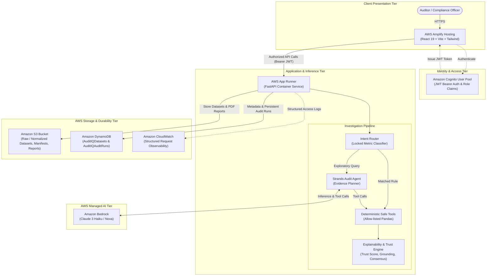

# AuditIQ Cloud

> **Evidence-backed AI financial audit investigation on AWS**

AuditIQ Cloud allows finance and internal audit teams to upload transaction datasets, automatically detect suspicious financial irregularities, investigate questions using natural language, and receive evidence-backed findings with quantifiable trust, data provenance, narrative grounding, and complete reproducibility.

---

## 🎯 The Problem

Corporate finance and internal audit teams handle hundreds of thousands of transactions across multiple ERPs, spreadsheets, and vendor systems. Traditional spreadsheet reviews and static scripts are slow, error-prone, and lack investigative flexibility. Conversely, generic "ChatGPT for Excel" tools hallucinate numbers, execute untrusted arbitrary code, and provide zero verifiable evidence that can withstand scrutiny before an audit committee or regulatory body.

---

## 💡 The Solution

**AuditIQ Cloud** combines the intuitive investigation flexibility of conversational AI with the rigorous precision of **deterministic execution**:

# "AI decides; deterministic tools execute."

- The AI agent reasons over questions and selects safe, allow-listed audit tools.
- Calculations are strictly executed by deterministic Pandas logic against the actual transaction records.
- Every claim in the narrative is automatically checked against the computed numbers (**Narrative Grounding**).
- Every result exposes a calibrated **Trust Score (0–100)**, full **Data Lineage**, and a tamper-evident **Reproducibility Fingerprint (Replay ID)**.

---

## ☁️ AWS Cloud Architecture



### AWS Native Services Utilized:
- **AWS Amplify Hosting**: Globally distributed modern React 19 / Vite single-page application.
- **Amazon Cognito**: User Pools authenticating audit personnel with role-based access control (`AUDITOR`, `ADMIN`) and IDOR protection.
- **AWS App Runner**: Fully managed, auto-scaling containerized FastAPI backend.
- **Amazon Bedrock**: High-intelligence LLM reasoning (Claude 3 Haiku / Nova) with zero data training leakage.
- **Strands Agents SDK**: Agent orchestration connecting Bedrock reasoning to deterministic safe audit tools.
- **Amazon S3**: Private, AES-256 encrypted object storage persisting raw uploads, normalized datasets, manifests, and PDF audit reports.
- **Amazon DynamoDB**: Sub-millisecond persistent metadata storage for datasets and immutable audit runs.
- **Amazon CloudWatch**: Structured request observability, execution latency, and audit trail metrics.

---

## 🛡️ Core Explainability & Trust Features

| Feature | Description |
| :--- | :--- |
| **Calibrated Trust Score** | 0–100 composite score evaluating execution mode, grounding verification, evidence volume, and consensus. |
| **Narrative Grounding** | Validates that every numeric figure in the AI narrative matches the deterministic query calculation. |
| **Safe Execution Engine** | Rejects arbitrary code execution (`exec`/`eval`); only pre-sanitized allow-listed Pandas tools run. |
| **Dual-Run Consensus** | Optional independent second-opinion plan verification comparing plan similarity and evidence overlap. |
| **Reproducibility Fingerprint** | Generates SHA-256 hashes (`dataset_hash`, `query_hash`, `plan_hash`) and a unique **Replay ID**. |
| **Persistent Audit Runs** | Every investigation is stored in DynamoDB & S3; past investigations can be reopened after server restarts. |
| **S3 PDF Reports** | Professional audit report generation exported to Amazon S3 with secure time-limited presigned URLs. |

---

## 🔍 Built-in Audit Checks & Anomaly Detections

AuditIQ Cloud features 10 deterministic audit metrics out of the box:
1. **Duplicate Vendor / GSTIN Mismatch**: Detects multiple vendor entities claiming the same GSTIN tax number.
2. **Round-Number Invoices**: Surfaces suspicious transactions divisible exactly by Rs 1,000 without fractional paise.
3. **Late Payments**: Identifies invoices paid more than 30 days after contractual due dates.
4. **Missing Purchase Orders**: Flags transactions exceeding Rs 10,000 processed without a valid PO.
5. **High-Value Outliers**: Identifies single transactions exceeding policy thresholds (Rs 2,00,000).
6. **Disputed Invoices**: Aggregates all transactions currently held in Disputed resolution status.
7. **Duplicate Invoice Numbers**: Detects identical invoice numbers billed across transactions.
8. **Statistical Spending Spikes**: Catches transactions exceeding 2 standard deviations above dataset average spend.
9. **Vendor Concentration**: Identifies vendor entities capturing over 12% of total cumulative spend.
10. **Potential Split Payments**: Catches multiple invoices structured just below round approval thresholds (e.g. 45k–50k and 90k–100k).

---

## 🚀 Getting Started Locally

### 1. Prerequisites
- Python 3.11+
- Node.js 18+ and npm
- (Optional) AWS CLI configured for live Bedrock / S3 / DynamoDB testing

### 2. Configure Environment
Copy `.env.example` to `.env`:
```bash
cp .env.example .env
```
*(When AWS credentials are not configured, AuditIQ Cloud operates in local development mode with seamless local storage fallbacks so you can test immediately.)*

### 3. Start Backend (FastAPI)
```bash
cd backend
python -m venv .venv
source .venv/bin/activate  # On Windows: .venv\Scripts\Activate.ps1
pip install -r requirements.txt
uvicorn app.main:app --reload --port 8000
```

### 4. Start Frontend (React + Vite)
In a new terminal:
```bash
cd frontend
npm install
npm run dev
```
Open **`http://localhost:5173`** in your browser.

---

## 🧪 Testing

Run the complete backend test suite (unit tests, golden regression, and AWS integration tests):
```bash
# From project root:
python -m unittest discover -s backend/tests -p "test_*.py"
```
Verify frontend production build:
```bash
cd frontend
npm run build
```

---

## 📦 Cloud Deployment

For detailed production instructions on deploying to **AWS App Runner**, **AWS Amplify**, **Amazon S3**, **Amazon DynamoDB**, and **Amazon Cognito**, please refer to:
- [AWS Deployment Guide](file:///docs/AWS_DEPLOYMENT.md)
- [AWS Target Architecture](file:///docs/AWS_ARCHITECTURE.md)
- [Migration Notes](file:///docs/MIGRATION_NOTES.md)
