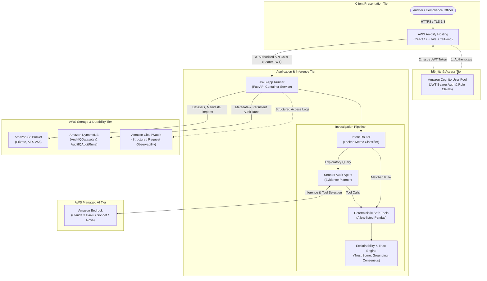

# AuditIQ Cloud — Target AWS Architecture

**AuditIQ Cloud** is an evidence-backed AI financial audit investigation platform deployed natively on Amazon Web Services (AWS). It unifies deterministic audit analytics with generative AI reasoning powered by Amazon Bedrock and the Strands Agents SDK.

---

## 1. End-to-End System Architecture



---

## 2. Core AWS Components

| Service | Role in AuditIQ Cloud | Security & Isolation Model |
| :--- | :--- | :--- |
| **AWS Amplify Hosting** | Delivers the responsive React/Vite web application globally with HTTPS and continuous deployment. | Connects to App Runner backend via configurable `VITE_API_BASE_URL`. |
| **Amazon Cognito** | Authenticates enterprise audit users and signs RS256 JSON Web Tokens with user roles (`AUDITOR`, `ADMIN`). | Backend derives user identity directly from verified JWT claims; prevents IDOR. |
| **AWS App Runner** | Runs the containerized Python/FastAPI backend with automatic HTTPS, scaling, and IAM role association. | Uses least-privilege IAM instance role rather than long-lived AWS access keys. |
| **Amazon S3** | Durable, encrypted object storage for raw transaction uploads, normalized CSVs, manifests, and PDF audit reports. | Completely private bucket (`block-public-access`), AES-256 server-side encryption, user-scoped object keys. |
| **Amazon DynamoDB** | Low-latency NoSQL database persisting dataset metadata (`AuditIQDatasets`) and immutable audit runs (`AuditIQAuditRuns`). | Keyed queries by `dataset_id`, `run_id`, and `user_id` without full-table scans. |
| **Amazon Bedrock** | Serverless foundation model runtime invoking high-accuracy models (Anthropic Claude / Amazon Nova) via Strands Agents SDK. | Zero prompt leakage: raw datasets are never fed into prompts; models operate strictly through deterministic tools. |
| **Amazon CloudWatch** | Centralized application observability logging HTTP status codes, query latencies, dataset IDs, and tool execution traces. | Strict data sanitization: no customer PII, tokens, or credentials appear in logs. |

---

## 3. Data & Investigation Lifecycle

```text
1. DATA INGESTION & DURABILITY
   User Upload -> FastAPI -> Write Raw to S3
                          -> Type Normalization & Column Profiling
                          -> Auto-detect 10 Policy Anomalies
                          -> Write Normalized CSV to S3
                          -> Write Manifest & Anomalies to S3
                          -> Write Metadata to DynamoDB

2. NATURAL LANGUAGE INVESTIGATION
   User Question -> Intent Router -> Locked Metric?
                                        |-- YES -> Instant Deterministic Pandas Execution -> Evidence
                                        |-- NO  -> Strands Bedrock Agent -> Safe Tool Selection -> Pandas Execution -> Evidence

3. TRUST & EXPLAINABILITY ENGINE
   Evidence Records -> Narrative Grounding Validation (Claims vs Evidence)
                    -> Trust Score Calculation (0-100 algorithm based on grounding, coverage, consensus)
                    -> Provenance Lineage Construction
                    -> Reproducibility Fingerprinting (Replay ID, Dataset Hash, Plan Hash)
                    -> Dual-run Consensus Verification (optional)

4. DURABLE AUDIT RUN PERSISTENCE
   Full Evidence & Result -> Stored in S3 (result key)
   Audit Run Metadata    -> Stored in DynamoDB (run_id, user_id, finding, trust, hashes)
   PDF Export Report     -> Generated by fpdf2, stored in S3, accessed via secure Presigned URL
```

---

## 4. Security Architecture

- **No Arbitrary Code Execution**: The AI never generates raw Python code, shell commands, or SQL. It selects from allow-listed deterministic tools (`find_duplicate_vendors`, `detect_spending_spike`, etc.) which execute safely in Pandas.
- **Prompt Injection Defense**: Dataset cell contents are treated as untrusted text and never injected into system instructions.
- **Zero Secrets in Source**: Uses AWS IAM instance roles for App Runner and environment variables for region and bucket targets.
- **IDOR Protection**: All dataset queries, audit runs, and PDF downloads enforce strict `user_id` matching derived from validated Cognito tokens.
